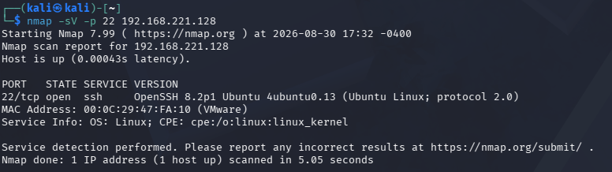
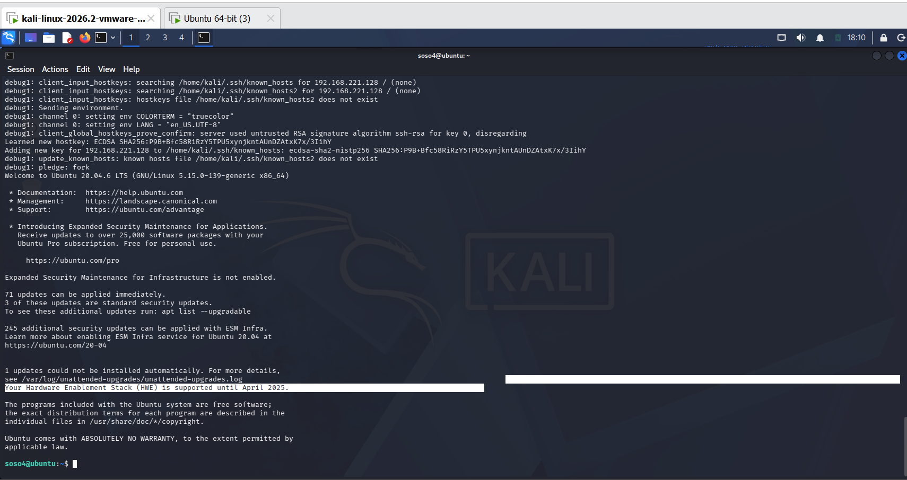
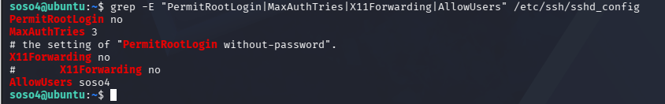
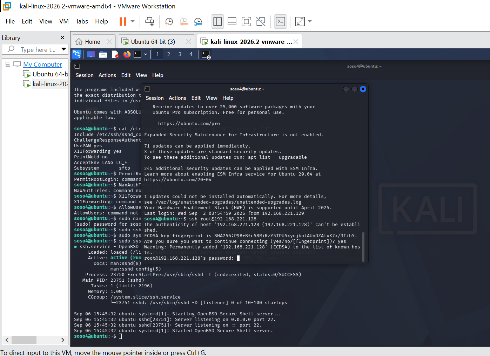

# Cybersecurity-home-lab
A Personal cybersecurity home lab built with VMware, Ubuntu and Kali Linux
## 🎯 Objectives

- Practice cybersecurity concepts in a controlled environment
- Improve Linux administration skills
- Understand virtual networking
- Perform security experiments
- Practice system hardening
- Document my learning journey

## 🖥️ Environment
- VMware
- Ubuntu
- Kali Linux

## 📚 Project Roadmap

1. Lab setup
2. Network configuration
3. Reconnaissance
4. Ubuntu hardening
5. Final documentation

## 🚧 Status
Project in progress.
## 🖥️ Virtual Machines

### Ubuntu

- VMware Workstation
- Network Adapter 1: NAT
- Network Adapter 2: VMnet1
- Private IP: `192.168.221.128/24`

### Kali Linux

- VMware Workstation
- Network Adapter 1: NAT
- Network Adapter 2: VMnet1
- Private IP: `192.168.221.129/24`

## 🔗 Connectivity Test

From Kali Linux:

`bash`
`ping -c 4 192.168.221.128 RESULT: 4 packets transmitted, 4 received, 0% packet loss`

## 🔎 Reconnaissance réseau avec Nmap

Depuis Kali Linux, un premier scan de la machine Ubuntu a été réalisé :

`bash`
`nmap 192.168.221.128`

Résultat initial :

 Hôte actif
 1000 ports TCP courants fermés

Un serveur SSH a ensuite été installé sur Ubuntu : 
`sudo apt install openssh-server`

Le service SSH a été vérifié avec : 
`sudo systemctl status ssh` 

État : active (running)

Un nouveau scan depuis Kali a permis de détecter le service : 
`22/tcp  open  ssh`

Une détection de version a ensuite été réalisée :
`nmap -sV -p 22 192.168.221.128`

### 📸 Résultat du scan



## ✅ Authentification SSH réussie

Après avoir corrigé l'erreur initiale (tentative de connexion avec l'utilisateur `kali`
au lieu du compte distant), la connexion SSH a été établie avec succès vers le compte
Ubuntu `soso4` :

```bash
ssh -v soso4@192.168.221.128
```

Résultat : la clé d'hôte a été apprise (`known_hosts`), et la session s'est ouverte
correctement sur Ubuntu 20.04.6 LTS.



## 🚧 Prochaines étapes

- Durcissement du service SSH (désactivation login root, auth par clé)
- Scans Nmap plus poussés (`-A`, `--script vuln`)
- Test de brute-force contrôlé (Hydra/Medusa)
- Mise en place de Fail2ban

## 🔒 Durcissement du service SSH

Après l'installation et l'authentification réussie, plusieurs réglages par défaut
ont été identifiés comme des risques inutiles dans `/etc/ssh/sshd_config` :

- `PermitRootLogin` non restreint
- Aucune limite sur les tentatives d'authentification
- `X11Forwarding` activé sans usage réel
- Aucune restriction sur les comptes autorisés à se connecter

### Modifications appliquées
PermitRootLogin no
MaxAuthTries 3
X11Forwarding no
AllowUsers soso4




### Vérification

Après redémarrage du service (`sudo systemctl restart ssh`) :
- ✅ La connexion avec le compte `soso4` fonctionne toujours normalement
- ✅ Une tentative de connexion avec le compte `root` est refusée



## 🚧 Prochaines étapes

- Test de brute-force contrôlé (Hydra/Medusa) pour valider l'efficacité du durcissement
- Mise en place de Fail2ban pour un blocage automatique